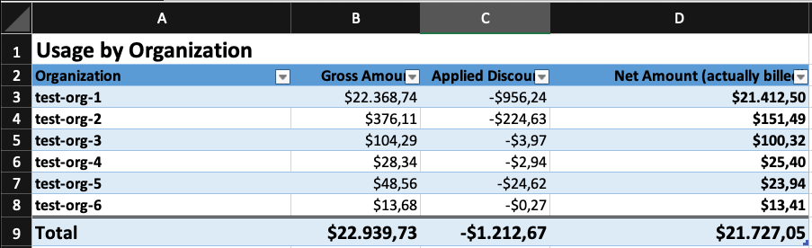
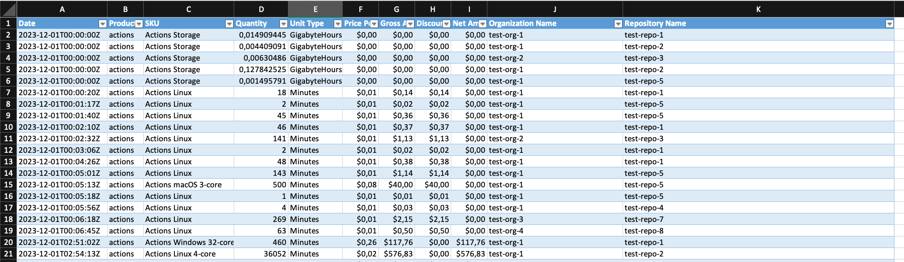

# GH Billing Report

A command line tool to use GitHub's new Billing APIs to export an Excel-Report with the usage for a given Billing-Cycle, grouped and aggregated by organization.



## Getting Started

### Using the GH Extension

The easiest way to use this tool is to install it as a [GitHub CLI](https://cli.github.com/) Extension.

1. Install the extension:

    ```bash
    gh extension install davelosert/billing-report
    ```

2. Create a [classical GitHub PAT](https://docs.github.com/en/authentication/keeping-your-account-and-data-secure/managing-your-personal-access-tokens#creating-a-personal-access-token-classic) with the scopes `manage_billing:enterprise` and `read:enterprise`

3. Generate the report:

    ```bash
    gh billing-report --enterprise my-enterprise --github-token $GITHUB_TOKEN
    ```

    This will generate a report for the current running calendar month and save it to the `./reports` folder of the current working directory. See the [Options Section below](#options) for more information on how to customize the report.

### Using the repo directly

You can also clone this repo and run the following commands:

```bash
go run . --enterprise my-enterprise --github-token $GITHUB_TOKEN
```

> [!NOTE]
> This requires you to have [Go](https://golang.org/) >1.21.5 installed on your machine.

## Options

All options can be set as flags via the command line:

```bash
gh billing-report --github-token <github-token> \
  --enterprise <enterprise-slug> \
  --year <year> \
  --month <month> \
  --billing-cycle <billing-cycle> \
  --report-path <report-path>
```

The `GITHUB_TOKEN` will be automatically read from the Environment-Variable, but can be overwritten using the `--github-token` flag.

| Option                            | Description                                                         | Default Value | Environment Variable |
| --------------------------------- | ------------------------------------------------------------------- | ------------- | -------------------- |
| `--github-token <github-token>`   | Github token, see below for permissions                             | None          | `GITHUB_TOKEN`       |
| `--enterprise <enterprise-slug>`  | Enterprise Slug to get the data from                                | None          | None                 |
| `--year <year>`                   | Specify the year, e.g. 2024                                         | Current year  | None                 |
| `--month <month>`                 | Specify the month, e.g. 1                                           | Current month | None                 |
| `--billing-cycle <billing-cycle>` | First day of your billing cycle (see below for further information) | 1             | None                 |
| `--report-path <report-path>`     | Directory where the report will be saved                            | `./reports`   | None                 |

### Billing Cycle

By default, the generated report covers an entire calendar month (e.g., `1st of January` to `31st of January`).

You can customize this range using the `--billing-cycle` option, which sets the start day of your billing cycle. The report will then cover the period

- from the specified **billing cycle day of the input month**
- to the day **before the same billing cycle day of the following month**

If the given billing cycle day does not exist in the given month, the first day of the next month will be used. See the following examples:

| Input                                      | Report Period                                     |
| ------------------------------------------ | ------------------------------------------------- |
| `--year 2024 --month 1 --billing-cycle 1`  | `1st of January 2024` to `31st of January 2024`   |
| `--year 2024 --month 1 --billing-cycle 15` | `15th of January 2024` to `14th of February 2024` |
| `--year 2024 --month 2 --billing-cycle 30` | `1st of March 2024` to `29th of March 2024`       |

> [!IMPORTANT]
> Please note that all cutoff dates are in UTC. Therefore, a report with `--year 2024 --month 1 --billing-cycle 15` will include all usage data from `15th of January 2024 00:00:00 UTC` to `14th of February 2024 23:59:59 UTC`.

### Github Token Permissions

You need to create a [classical GitHub PAT](https://docs.github.com/en/authentication/keeping-your-account-and-data-secure/managing-your-personal-access-tokens#creating-a-personal-access-token-classic) with the following Scopes:

- `manage_billing:enterprise`
- `read:enterprise`

## Output

Currently, the output is an Excel file containing the two sheets:

- **Usage by Organization**: Contains the aggregated usage by organization where:
  - **Gross Amount**: The gross amount of the usage
  - **Discount**: The discount applied to the usage
  - **Net Amount**: The net amount of the usage - this is what you will be billed
- **Detail Usage**: Contains all usage items of the billing cycle you specified so you can drill down into the data
    

## License

This project is licensed under the [MIT License](./LICENSE).
